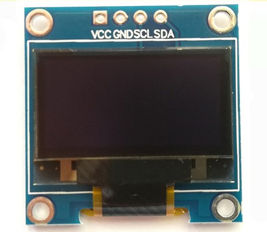

# "Chocolate"

[](start)
[](repo_size)
[](last_commit)
[](LICENSE)

这是一个基于 esp8266（_Nodemcu_）开发板的玩具工程。
由模块堆积成的一块板子，神似巧克力（_抽象_）所以起名为 “__巧克力__”

功能是辅助树莓派，可以远程显示一些树莓派的硬件资源信息，再进行一些已经定制好的操作。目前功能还在扩展中，有一些更有趣的功能会继续跟进更新。。。

---

## 目录

- [硬件组成](#硬件组成)
- [开发环境（推荐）](#开发环境)
- [功能介绍](#功能介绍)
- [消息转发流程](#消息转发流程)
- [改进方向](#改进方向)
- [License](#License)

---

## 硬件组成

### 所需的模块

- Nodemcu(esp8266)
- oled屏幕（i2c, 0.96寸）
- 4枚按键开关

Nodemcu引脚图：


oled屏幕：


按键开关(自选即可)：


### 所需引脚与定义

1. Nodemcu:
    - oled屏幕（i2c）: <kbd>GPIO12</kbd>， <kbd>GPIO14</kbd>

    ``` c
    U8G2_SSD1306_128X64_NONAME_F_SW_I2C u8g2(U8G2_R0, 12, 14);
    ```

    - 按键 : <kbd>GPIO0</kbd>, <kbd>GPIO4</kbd>, <kbd>GPIO5</kbd>, <kbd>GPIO13</kbd>

    ``` c
    uint8_t enterKey = 5;
    uint8_t backKey = 4;
    uint8_t rightKey = 13;
    uint8_t leftKey = 0;
    ```

    - 板载led : <kbd>GPIO2</kbd>

    ``` c
    int onboardledPin = 2;
    ```

---

## 开发环境

### 推荐环境需要

- 编辑器：vscode
- 编辑器插件：PlatformIO（上墙）
- 平台（代码框架）：arduino

### 第三方库

- [olikraus/U8g2@ 2.28.8](https://github.com/olikraus/U8g2_Arduino?utm_source=platformio&utm_medium=piohome)
- [bblanchon/ArduinoJson@ 6.18.4](https://github.com/bblanchon/ArduinoJson?utm_source=platformio&utm_medium=piohome)
- [knolleary/PubSubClient@ 2.8](https://github.com/knolleary/pubsubclient?utm_source=platformio&utm_medium=piohome)
- [arduino-libraries/NTPClient@ 3.1.0](https://github.com/arduino-libraries/NTPClient?utm_source=platformio&utm_medium=piohome)

---

## 功能介绍

### 功能总览

| 功能 | 完成状况 |
| :---: | :---: |
| 时间显示 | :heavy_check_mark:|
| WiFi | :heavy_check_mark: |
| MQTT | :heavy_check_mark: |
| 倒计时 | :x: |
| 生命时钟 | :x: |
| 日历 | :x: |
| 树莓派资源显示 | :heavy_check_mark: |
| 树莓派控制 | :heavy_check_mark: |
| 提醒 | :x: |
| web设置 | :x: |

### 树莓派资源显示的项目

1. cpu
    - 温度
    - 频率
    - 使用率
2. 内存
    - 物理总内存
    - 已使用
3. 存储
    - 总容量
    - 已使用
    - 使用率
4. 网络
    - ip
    - 上传速度
    - 下载速度
5. 开机时间

### 树莓派控制

1. 关机
2. 重启

---

## 消息转发流程

采用mqtt协议，存在外网中间服务器进行消息转发（能够较为简单的实现未知ip情况下，消息的传递）

``` text
树莓派 --> 服务器 --> chocolate
chocolate --> 服务器 --> 树莓派
```

---

## 改进方向

- [ ] 重构代码，增强可扩展性、可维护性
- [ ] 继续优化操作流程，使其使用更简易，界面更明了
- [ ] 优化oled显示，适当增加动画（必要时更换显示驱动）
- [ ] 优化内部存储空间，删除冗余的数据

---

## License

[MIT © Richard McRichface.](./LICENSE)
